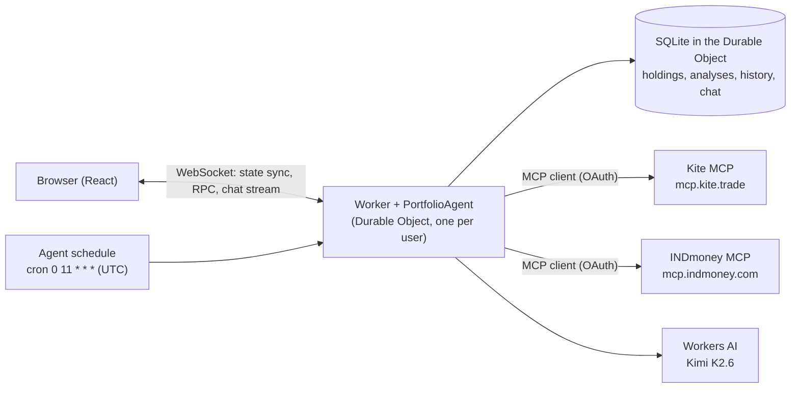

# Coffee Can: AI portfolio agent on Cloudflare

Coffee Can is a small investing assistant for a long-term ("coffee can") investor in India. It runs entirely on Cloudflare:

- **Dashboard:** portfolio value, gain, today's change, allocation, value over time, and a holdings table.
- **Connectors:** connect **Zerodha (Kite)** and **INDmoney** through their official MCP servers. Holdings are fetched over MCP and stored in the agent's database.
- **Chat:** ask questions about your investments. Answers come from your stored portfolio and the latest analysis.
- **Daily analysis:** a schedule runs every day at 4:30 PM IST. It refreshes holdings from the brokers, writes a short review with Workers AI, and updates the dashboard live.

No broker account? Press **Load demo portfolio** to try everything with made-up data.

## Architecture



| Requirement             | Cloudflare product                                                         | Where                                             |
| ----------------------- | -------------------------------------------------------------------------- | ------------------------------------------------- |
| LLM                     | Workers AI (`@cf/moonshotai/kimi-k2.6`) through `workers-ai-provider`      | `src/server.ts` (`model()`)                       |
| Workflow / coordination | Agents SDK on Durable Objects, with `schedule()` for the daily cron        | `src/server.ts` (`dailyAnalysis`)                 |
| User input via chat     | `AIChatAgent` + `useAgentChat` over WebSockets, streaming                  | `src/server.ts` (`onChatMessage`), `src/chat.tsx` |
| Memory / state          | Durable Object SQLite (`this.sql`) + agent state synced to the browser     | `src/server.ts`, `src/dashboard.tsx`              |
| External tools          | Agents SDK MCP client (`addMcpServer`, `mcp.callTool`) with built-in OAuth | `src/server.ts` (`refreshBroker`)                 |
| Hosting                 | Workers static assets (single Worker serves the UI and the agent)          | `wrangler.jsonc`                                  |

### How it works

1. Each browser gets a random id (kept in `localStorage`) and connects to its own `PortfolioAgent` instance. There is no login; whoever has the id has the portfolio.
2. **Connect** calls `addMcpServer()` on the agent. If the broker needs OAuth, the dashboard shows **Authorize**, which opens the broker's consent page; the SDK handles the callback and stores the tokens in the Durable Object.
3. The agent calls the broker's read-only tools (`get_holdings` and `get_mf_holdings` on Kite, `networth_holdings` on INDmoney), turns the results into holdings (`src/portfolio.ts`), and writes them to SQLite.
4. The agent recomputes totals, allocation and history and calls `setState()`, so every open dashboard updates instantly.
5. `dailyAnalysis()` runs on the cron, or from **Run analysis**. It refreshes, sends a compact portfolio JSON to Workers AI, parses the JSON review, and stores it (the last 60 are kept).
6. The chat model sees the portfolio and the latest review in its system prompt. It has three tools: `refreshPortfolio`, `getPastAnalyses` and `runDailyAnalysis`.

### Safety choices

- **The model never gets the broker tools.** Kite's MCP server can place orders; the agent calls only the read-only tools itself, and the chat model gets just the three tools above.
- **Fixed broker URLs.** The agent connects only to the two known MCP servers, never to a URL the client sends.
- **Not advice.** Prompts tell the model to explain trade-offs and never tell the user to buy or sell.

## Run it locally

Requirements: Node 22+ and a free Cloudflare account. Workers AI has no local simulator, so local dev uses the real service.

```bash
npm install
npx wrangler login
npm run dev
```

Open http://localhost:5173, then press **Load demo portfolio**.

## Deploy

```bash
npm run deploy
```

This builds the React app and deploys the Worker, the Durable Object and the static assets. It prints a `*.workers.dev` URL.

## Tests

```bash
npm test
npm run check
```

`npm test` runs the unit tests for the MCP result parsers, metrics and analysis parsing. `npm run check` adds formatting, lint and type checks.

## Known limitations

- **Kite logins expire every day around 6 AM IST.** That's Zerodha's rule. When the session has expired, the dashboard shows **Log in to Kite** with a fresh link, and the daily run analyses the last stored holdings.
- **INDmoney's response format isn't documented.** The parser maps common field names, and Zerodha rows reported by INDmoney are skipped to avoid double counting. If INDmoney's server doesn't accept third-party MCP clients, connecting will show an error.
- **No accounts.** The portfolio belongs to the browser. Clearing site data starts a new, empty portfolio. Adding sign-in (e.g. Cloudflare Access or GitHub OAuth) would map users to agents by account instead.
- **Not zero-knowledge.** Holdings are stored in plain form in the user's Durable Object (Cloudflare encrypts storage at rest). A server-side daily analysis has to read the data, so end-to-end encryption would only move the key to the server.
- **All amounts are treated as INR.** US holdings are shown at the INR value INDmoney reports.
- **Research only, not financial advice.**

## Project layout

```
src/server.ts      Worker entry and PortfolioAgent: storage, MCP connectors, daily analysis, chat
src/portfolio.ts   Types, MCP result parsers, metrics, demo data, formatting
src/analysis.ts    Prompts and analysis parsing
src/app.tsx        Layout, agent connection
src/dashboard.tsx  Dashboard and connector cards
src/chat.tsx       Chat panel
test/              Unit tests (Vitest)
```

Built from Cloudflare's [agents-starter](https://github.com/cloudflare/agents-starter) template.
